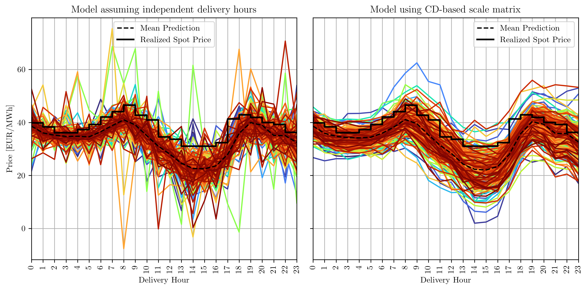

# Regularized Online Multivariate Distributional Regression

This repo holds the experiments for the Paper _[Online Multivariate Regularized Distributional Regression for High-dimensional Probabilistic Electricity Price Forecasting
(Link to Arxiv)](https://arxiv.org/abs/2504.02518)_.

## The Paper Summarized in 2 Plots

The day-ahead electricity market is the main venue for trading electricity in Germany. A lot of work is done on forecasting the prices, however, many papers treat the 24 hourly day-ahead prices as 24 independent univariate time series. However, the prices are strongly correlated across hours of the day. If you want to optimize a portfolio / a battery / a power plant, you need to take these dependencies into account. Hence, you want your simulations to reflect these dependencies, that is, you want the predictions to look like the right figure, and not like the left:



To achieve this, we use a multivariate distributional regression model that models the full joint distribution of the 24 prices. This allows us to capture the dependencies between the prices, also conditional on covariates like renewable energy forecasts or daily seasonality.

However, distributional regression models are pretty slow to fit. Therefore, we develop an online algorithm that is much faster to fit, while achieving similar predictive performance. The following figure shows the trade-off between computation time and predictive performance (log-score). The proposed online algorithm (blue) achieves similar performance as the batch algorithm (orange), but is much faster to fit.


## Data

The data used in the revised version of the paper is not included in this repository as it cannot be shared publicly. The author gratefully acknowedges Arkadiusz Lipiecki, Bartosz Uniejewski, Rafał Weron for sharing the data and allowing its use in this research. Please contact the authors of [Lipiecki et al. "Postprocessing of point predictions for probabilistic forecasting of day-ahead electricity prices: The benefits of using isotonic distributional regression". Energy Economics 139 (2024)](https://www.sciencedirect.com/science/article/pii/S014098832400642X) for access to the data.

A similar, but shorter dataset can be taken from [Marcjasz, Grzegorz, et al. "Distributional neural networks for electricity price forecasting." Energy Economics 125 (2023)](https://www.sciencedirect.com/science/article/pii/S0140988323003419?casa_token=l42k_WCgotYAAAAA:ee4hs1n7VyZDJlczYjv9Ja86pdcpZJ19K-tToJc7WEX-KxNOmk3GS_gG2qfmOrlk7h2vQAx2uf1R) and the according [Github repository](https://github.com/gmarcjasz/distributionalnn). The differences between both data sets are discussed in Lipiecki et al. (2024). The initial version of this paper was based on this data set and the results qualitatively hold for both data sets.

Please name the data set and place it in this folder:

```bash
/experiments/epf_germany/de_price_long.csv
```

and ensure it has the following columns:

- [empty]
- Price
- Load_DA_Forecast
- Renewables_DA_Forecast
- EUA
- API2_Coal
- TTF_Gas
- Brent_oil

so that the data preprocessing script works without changes.

## Requirements

The following packages are needed to run the experiments

- scipy
- numba
- numpy
- pandas
- scikit-learn
- ondil
- scoringrules
- matplotlib
- seaborn
- arch
- tqdm

## Reproduction steps

The file `run_study.sh` contains a bash script that creates a conda environment, installs the requirements and runs the experiments. Please adjust the name of the conda environment as needed. Please ensure that you have the data file available!

- Clone the repo.
- Download the data as described above and place it in the folder `data` (create it if necessary).
- Create a virtual environment and install the requirements.
- From the top-level folder, run `python experiments/epf_germany/00_run_study.py`.

## Code in `\src`

If you want to run individual files as notebooks, please ensure you can import the code from `/src`. This is done in the experiment code by the following line:

```python
sys.path.append(os.path.abspath(os.path.dirname(__file__)))
```

which appends the working directory to the `PATH`. If you're on a Windows machine, you might need to adjust this code.

## Acknowledgements

Simon Hirsch is employed as an industrial PhD student by Statkraft Trading GmbH and gratefully acknowledges the support and funding received. This work contains the author’s opinions and does not necessarily reflect Statkraft’s position.
